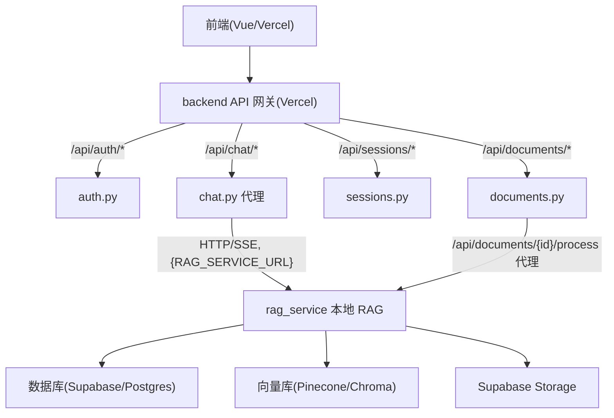

## RAG 智能问答系统

这是一个基于 RAG (Retrieval-Augmented Generation) 的智能问答系统，支持多文档对话、知识库管理等功能。

### 技术栈与整体架构

- **前端**: Vue 3 + TypeScript + Vite（部署到 Vercel）
- **Backend（Vercel 网关）**: FastAPI + Mangum（Serverless Functions）
- **rag_service（本地 RAG 服务）**: FastAPI + LangChain + LangGraph

整体架构：



## 功能特点

- 📚 **多文档支持**：支持上传 PDF、Word 等多种格式文档
- 🔍 **智能检索**：基于向量数据库的语义检索
- 💬 **上下文对话**：支持多轮对话，保持上下文连贯
- 🎨 **现代化界面**：Vue 3 构建的现代化 Web 界面
- ⚡ **实时响应**：SSE 流式输出，实时显示 AI 回复

## 项目结构

```text
rag_vue/
├── frontend/           # Vue 3 + TS 前端（Vercel 部署）
│   └── ...             # 详见 frontend 目录
├── backend/            # Vercel 轻量网关（FastAPI + Mangum）
│   ├── api/            # 认证/文档元数据/会话/RAG 代理路由
│   ├── core/           # 配置、依赖注入、中间件
│   ├── services/       # 用户/会话/文档元数据服务（无 RAG 逻辑）
│   ├── database/       # DAO 与模型
│   ├── utils/          # 通用工具（无向量/模型逻辑）
│   ├── pyproject.toml  # backend 独立依赖
│   ├── README.md       # backend 说明
│   └── DEPLOYMENT.md   # backend 部署文档（Vercel）
├── rag_service/        # 本地 RAG 服务（FastAPI + LangGraph）
│   ├── api/            # /api/chat/message, /api/documents/* 等
│   ├── services/       # RAG 核心逻辑、向量库、文档处理
│   ├── utils/          # 配置、模型下载、分块、清洗等
│   ├── database/       # 复用 DAO（访问同一数据库）
│   ├── pyproject.toml  # rag_service 独立依赖
│   ├── README.md       # rag_service 说明
│   └── DEPLOYMENT.md   # rag_service 部署文档
└── pyproject.toml      # 根 pyproject，仅声明 Python 版本（依赖在子项目中管理）
```

## 快速开始

### 环境要求

- Python 3.10+
- Node.js 18+
- Poetry (Python 包管理)
- npm 或 yarn

### backend 启动（本地）

```bash
cd backend
pip install .
# 配置 backend/.env，参考 backend/DEPLOYMENT.md 或 config_template.txt
uvicorn backend.main:app --reload
```

backend 默认在 `http://localhost:8000` 启动。

访问 API 文档：
- Swagger UI: http://localhost:8000/docs
- ReDoc: http://localhost:8000/redoc

### 前端启动

```bash
# 1. 进入前端目录
cd frontend

# 2. 安装依赖
npm install

# 3. 配置环境变量（可选）
# 创建 frontend/.env.local 文件：
# VITE_API_BASE_URL=http://localhost:8000

# 4. 启动开发服务器
npm run dev
```

前端将在 `http://localhost:5173` 启动

## 环境变量配置

在 `backend/` 目录创建 `.env` 文件，参考 `backend/config_template.txt` 配置以下变量：

### 必需配置

- `ANTHROPIC_API_KEY`: LLM API Key
- `ANTHROPIC_BASE_URL`: LLM API 地址（如 MiniMax）

### 模式配置

- `STORAGE_MODE`: `local` 或 `cloud`（文件存储模式）
- `VECTOR_DB_MODE`: `local` 或 `cloud`（向量库模式）
- `DATABASE_MODE`: `local` 或 `cloud`（数据库模式）

### 云服务配置（cloud 模式时必需）

**Supabase Storage** (STORAGE_MODE=cloud):
- `SUPABASE_URL`
- `SUPABASE_KEY`
- `SUPABASE_SERVICE_KEY`
- `SUPABASE_STORAGE_BUCKET`

**PostgreSQL** (DATABASE_MODE=cloud):
- `DATABASE_URL`

**Pinecone** (VECTOR_DB_MODE=cloud):
- `PINECONE_API_KEY`
- `PINECONE_ENVIRONMENT`
- `PINECONE_INDEX_NAME`

### 认证配置

- `JWT_SECRET_KEY`: JWT 密钥（使用 `python -c "import secrets; print(secrets.token_urlsafe(32))"` 生成）
- `JWT_EXPIRY_DAYS`: Token 过期天数（默认 30）

## API 端点

### 认证

- `POST /api/auth/login` - 登录
- `POST /api/auth/register` - 注册
- `POST /api/auth/logout` - 登出
- `GET /api/auth/me` - 获取当前用户

### 对话

- `POST /api/chat/message` - 发送消息（SSE 流式）
- `GET /api/chat/sessions` - 获取会话列表
- `POST /api/chat/sessions` - 创建会话
- `DELETE /api/chat/sessions/{id}` - 删除会话
- `GET /api/chat/sessions/{id}/messages` - 获取会话消息

### 文档

- `GET /api/documents` - 获取文档列表
- `POST /api/documents/upload` - 上传文档
- `DELETE /api/documents/{id}` - 删除文档
- `GET /api/documents/{id}/status` - 获取文档状态

## 开发说明

### 前端技术栈

- Vue 3 (Composition API)
- TypeScript
- Vue Router
- Pinia (状态管理)
- Axios (HTTP 客户端)
- Vite (构建工具)

### 后端技术栈

- FastAPI (Web 框架)
- Pydantic (数据验证)
- JWT (认证)
- SSE (Server-Sent Events 流式输出)
- LangChain (RAG 框架)
- Chroma / Pinecone (向量数据库)

### 数据库初始化

首次运行前需要初始化数据库：

**SQLite (本地模式)**:
```bash
sqlite3 data/rag.db < backend/database/init_db.sql
```

**PostgreSQL (云模式)**:
```bash
psql $DATABASE_URL < backend/database/init_db_postgres.sql
```

## 测试

```bash
# 运行后端测试
cd backend
python -m pytest tests/ -v
```

## 部署

详细部署说明请参考 [DEPLOYMENT.md](./DEPLOYMENT.md)

## 注意事项

1. **CORS**：开发环境已配置，生产环境需要设置正确的 CORS 源
2. **文件上传**：Vercel 有 4.5MB 限制，大文件需要分块上传
3. **SSE**：确保服务器支持 Server-Sent Events
4. **认证**：Token 存储在 localStorage，生产环境建议使用 httpOnly cookie
5. **环境变量**：不要将包含真实密钥的 `backend/.env` 文件提交到 Git

## 许可证

MIT
